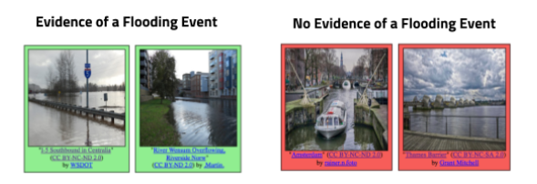

# Flood-Recognition

[Link of raw dataset](https://www.kaggle.com/datasets/nguyenhoangthaik17hl/dpl-fall2023/)

[Link of dataset which I used in code](https://www.kaggle.com/datasets/phmnhnguyt/handwriting-model/)

### Task Description
The goal of this task is to retrieve all images which show direct evidence of a flooding event from social media streams, independently of a particular event. The objective is to design a system/algorithm that given any collection of multimedia images and their metadata (e.g., YFCC100M, Twitter, Wikipedia, news articles) is able to identify those images that are related to a flooding event. Please note, that only those images which convey an evidence of a flooding event will be considered as True Positives. Specifically, we define images showing unexpected high water levels in industrial, residential, commercial and agricultural areas“ as images providing evidence of a flooding event. The main challenges of this task are the proper discrimination of the water level in different areas (e.g., images showing a lake vs. showing high water at a street) as well as the consideration of different types of flooding events (e.g., coastal flooding, river flooding, pluvial flooding).

### Submission Format
For every author in the dataset, submission files should contain two columns: id and label.
The file should contain a header and have the following format:
```
id,label
1,1
2,0
```

### Step for step:
#### Step 1: Preparing Dataset Process
Convert the raw image to matrix format
[File here](Data_Preparation.ipynb)
#### Step 2: Loading Dataset Process
Load the [matrix image dataset](https://www.kaggle.com/datasets/phmnhnguyt/handwriting-model/)
#### Step 3: Model Building
I use ConvNeXtXLarge and add some layers for my code.
#### Step 4: Model Training
I use checkpoint to save the model which has best accuracy.
I use reduce_lr to reduce learning rate in a period which does not improve the accuracy.
#### Step 5: Model Testing
Load the model (I use general model, you can use the best_checkpoint_model instead) to use.
After that, I predict all test images and save it into an csv file to submit.


